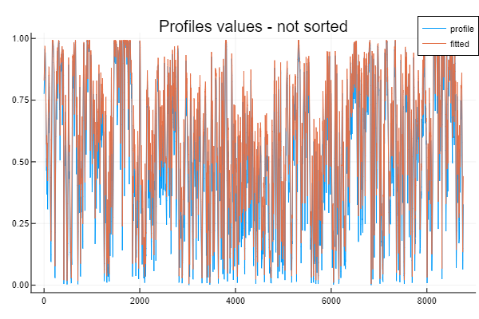
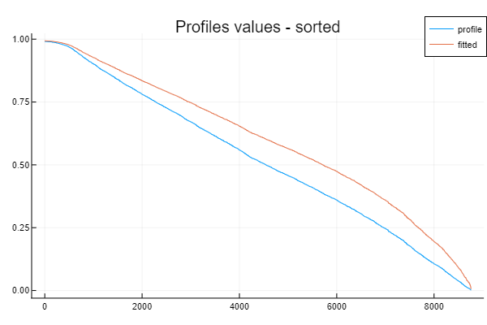

# Example

[TulipaProfileFitting.jl](https://github.com/TulipaEnergy/TulipaProfileFitting.jl) is primarily used to fit power production curves of renewable sources such as wind and solar. In this example, we have generated a time series for a wind power plant's power production using a method developed in [1]. The file [wind\_power\_profile.csv](./files/wind_power_profile.csv) contains all the details of the profile.

So, Let's start loading the values from the file!

[1] Staffell, I., & Pfenninger, S. (2016). Using bias-corrected reanalysis to simulate current and future wind power output. Energy, 114, 1224-1239. <https://doi.org/10.1016/j.energy.2016.08.068>

```julia
using TulipaProfileFitting
using CSV
using Plots

file_url = "https://github.com/TulipaEnergy/TulipaProfileFitting.jl/tree/main/docs/src/files/wind_power_profile.csv"

df = DataFrame(CSV.File(file_url, header=4))
```

From the dataframe we can get the profile values as follows:

```julia
profile_values = df.electricity
```

The current capacity factor (e.g., mean value) can be determined using the following command:

```julia
current_cp = round(sum(profile_values)/8760;digits=2)
```

Let's define a new capacity factor as 0.6

```julia
target_cp = 0.6
```

We can use the function ``fit\_profile`` in this package to obtain the coefficient that fit the values to the target.

```julia
coefficient = fit_profile(profile_values, target_cp)
```

The coefficient is the output of an optimization problem. To learn more, please refer to the mathematical formulation section.

Using the coefficient, we can determine the new profile and plot the power production curves.

```julia
fitted_profile = profile_values.^coefficient
```

We can plot the results using:

```julia
plot(profile_values, label="profile")
plot!(fitted_profile, label="fitted")
plot!(title="Profiles values - not sorted")
```



```julia
plot(sort(profile_values,rev=true), label="profile")
plot!(sort(fitted_profile,rev=true), label="fitted")
plot!(title="Profiles values - sorted")
```



It can be observed that the fitted curve primarily affects the intermediate value within the entire range. The values closer to one or zero remain relatively unchanged. This outcome is expected since the primary objective of the package is to adjust the intermediate value, thereby increasing or decreasing the capacity factor.
