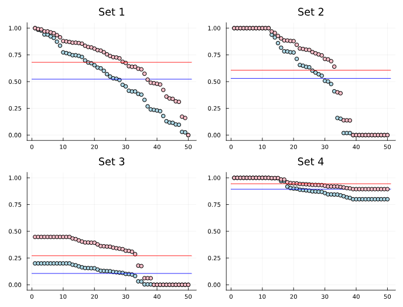
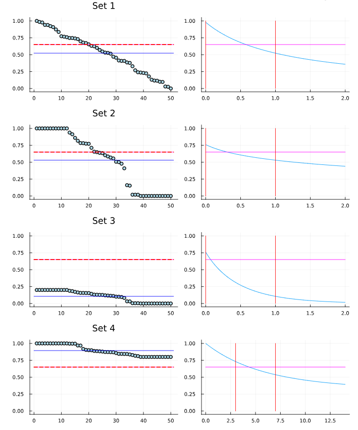

# Mathematical Formulation

Given a list of $m$ numbers $1 \geq p_1 \geq p_2 \geq \cdots \geq p_m \geq 0$ (e.g., a renewable energy production profile), and a target value $\mu \in (0, 1)$, we are looking for a solution to

$$\frac{1}{m}\sum_{i=1}^m p_i^x = \mu.$$

Questions:

1. When is it possible to find such $x$?
2. If such $x$ exists, how do we find it?
3. What to do when it is not possible to find such $x$?

Since both $p_i$ and $x$ can be zero, $p_i^x$ can be undefined. [In Julia, and other programming languages](https://en.wikipedia.org/wiki/Zero_to_the_power_of_zero), $0^0$ is commonly defined as 1. However, it doesn't make sense for the fitting profile application since the $p_i$ values are fixed, and $x$ is variable. Therefore, we define $\sigma:[0,1]\times[0,\infty)$ as:

$$\sigma(p, x) = \left\{\begin{array}{ll}p^x, \ & \text{if } p > 0, \\ 0, \ & \text{otherwise}.\end{array}\right.$$

This allows $x \mapsto \sigma(p, x)$ to be continuous for any value $p \in [0, 1]$.

Therefore, the problem can be redefined as finding $x$ such that

$$\frac{1}{m}\sum_{i=1}^m \sigma(p_i, x) = \mu.$$

However, to avoid this notation, we can assume, without loss of generality, that there are $r$ non-zero $p_i$, i.e., $p_1 \geq \cdots \geq p_r > 0$, and $p_{r+1} = \cdots = p_m = 0$.

This simplifies the problem to finding $x$ such that

$$\frac{1}{m} \sum_{i=1}^r p_i^x = \mu.$$

Let's define $S(x) = \frac{1}{m}\sum_{i=1}^r p_i^x$ to help us with the notation.

To visualize the problem, we are going to use four sets of possible profile values:

- a set with a 0 and a 1
- a set with a lot of 0s and 1s (25% each)
- a set that only contains numbers from 0 to $\alpha < 0.5$.
- a set that only contains numbers from $1 - \alpha$ to 1.

First, let's visualize the effect of $p_i^x$ on these sets. The figure below displays the original values in `lightblue`, sorted from the maximum to the minimum. The mean value of the original data is indicated in `blue`. Furthermore, the value for $x=0.5$ is indicated in `pink`, and the new mean is depicted in `red`.

Furthermore, let's take a look at the plot of $S$ for each of the sets.

**Question 1**: Since $p^0 = 1$ for positive $p$, then $S(0) = \frac{r}{m}$.
$S$ is non-increasing since

$$S'(x) = \frac{1}{m} \sum_{i=1}^r p_i^x \ln p_i \leq 0.$$

And assuming that there are $n$ values such that $p_i = 1$, then

$$\lim_{x \to \infty} S(x) = \frac{n}{m}.$$

This means that there is a solution to the problem if $\dfrac{n}{m} < \mu \leq \dfrac{r}{m}$.

**Question 2**:
Assuming $S$ decreasing and $\mu$ in range, we can solve the problem by looking for an interval $[a, b]$ such that $S(x) - \mu$ changes sign.
This can be done by creating an increasing sequence of points $v_1, v_2, \dots$, such that $v_1 = 0$, and $v_{i+1} > v_i$ with $\lim_{i \to \infty} v_i = \infty$.
For instance, the sequence $0, 1, 2, 4, 8, \dots$.

Since $S$ is decreasing, and $\mu$ is in range, then either $S(v_i) = \mu$ for some $v_i$, or $S(x) - \mu$ will change sign in some interval $[v_i, v_{i+1}]$.

Given the interval, we perform a bisection search or similar.

**Question 3:** If $\mu > \dfrac{r}{m}$, then $x = 0$ will yield $S(0) = \dfrac{r}{m}$, which is the closest to $\mu$.

Alternatively, if $\mu \leq \dfrac{n}{m}$, then $S(x) \to \dfrac{n}{m}$ as $x \to \infty$. In this case, we just select a reasonably large value for $x$.

The graph below displays the results of each set with a target mean of $\mu = 0.65$. The plots on the left-hand side highlight the target value in `red`. Meanwhile, the plots on the right-hand side depict the interval $\dfrac{n}{m} < \mu \leq \dfrac{r}{m}$. We can observe that the function S of each set of values intersects with the target value.

